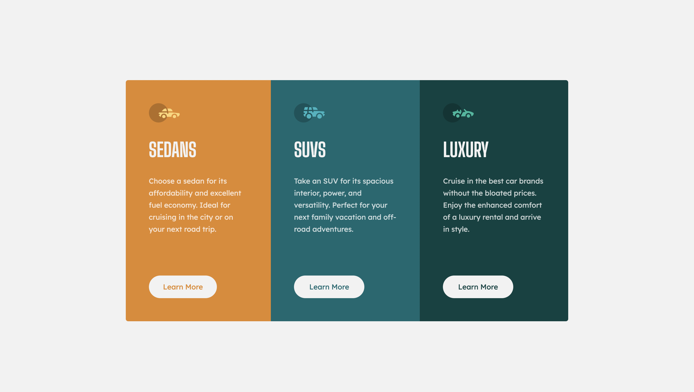

<h1 align="center">3-column preview card component</h1>

  <h3>
    <a href="https://eliel-souza.github.io/three-column-card-frontendmentor/">
      Site
    </a>
     |     
    <a href="https://www.frontendmentor.io/challenges/3column-preview-card-component-pH92eAR2-">
      Challenge
    </a>
  </h3>

&nbsp;

&nbsp;

## Sobre o Projeto

Este desafio de HTML e CSS é perfeito para quem quer estudar Flexbox, Grid e Responsividade.
Seu desafio é criar o **3-column preview card component** e deixá-lo o mais próximo possível do design.
Você pode usar qualquer ferramenta que desejar para ajudá-lo a concluir o desafio. Portanto, se você tem algo que gostaria de praticar, sinta-se à vontade para utilizar.

Seus usuários devem ser capazes de:

- Visualizar o layout ideal, dependendo do tamanho da tela do dispositivo
- Visualizar os estados de foco para elementos interativos

## Construído com

- HTML5 Semântico
- CSS3
- BEM
- Flexbox
- Grid
- Mobile-first
